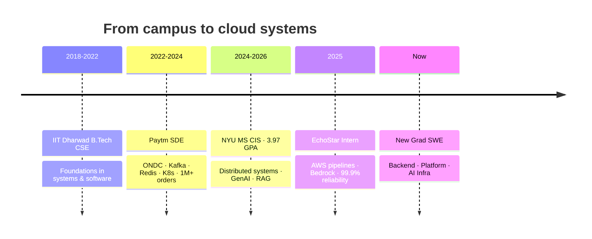
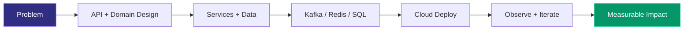
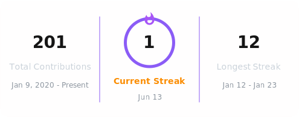

<!-- ===================== HEADER ===================== -->
<a href="https://github.com/nckhemanth">
  
</a>

<div align="center">


<br/><br/>

<a href="https://www.linkedin.com/in/hemanth-reddy-a22a931a0/"></a>&nbsp;
<a href="mailto:nckhemanthreddy7@gmail.com"></a>&nbsp;
<a href="https://nckhemanth.cloud"></a>&nbsp;
<a href="https://leetcode.com/u/__Hemanth_Reddy__/"></a>&nbsp;
<a href="https://github.com/nckhemanth"></a>&nbsp;


<br/><br/>

[](https://github.com/nckhemanth)

[](https://nckhemanth.cloud)

<br/>


&nbsp;

&nbsp;

&nbsp;

&nbsp;


<br/><br/>


</div>


<!-- ===================== STATUS BOARD ===================== -->
## &nbsp;🛰️&nbsp; Status Board

<div align="center">

| 🟢 Available | 🧠 Focus | 🛠️ Building | 📚 Leveling up |
|:---:|:---:|:---:|:---:|
| New Grad SWE roles | Backend · Cloud · GenAI | RAG platforms · agents | System Design · LeetCode |

</div>


<!-- ===================== IMPACT ===================== -->
## &nbsp;📈&nbsp; Impact at a Glance

<div align="center">

| 🛒 **1M+** | ☁️ **99.9%** | 💰 **97%** | ⚡ **40%** |
|:---:|:---:|:---:|:---:|
| Orders scaled<br/>ONDC @ Paytm | Upload reliability<br/>AWS @ EchoStar | Projected cost cut<br/>$7.3M/yr pipeline | Latency reduction<br/>Redis + Kafka |

| 🎫 **60%** | 🧠 **40%** | 🛠️ **75%** | ✅ **95%+** |
|:---:|:---:|:---:|:---:|
| Fewer support tickets<br/>Catalog reporting | Faster incident RCA<br/>Bedrock GenAI | Cart error reduction<br/>SQL + deadlocks | Code coverage<br/>TDD / BDD @ Paytm |

</div>


<!-- ===================== ABOUT ===================== -->
## &nbsp;👨‍💻&nbsp; About Me

<table>
<tr>
<td valign="top" width="68%">

```yaml
Hemanth Reddy:
  role:      New Grad Software Engineer
  based_in:  New York City, NY
  education:
    - NYU — MS Computer and Information Sciences · CGPA 3.97/4
    - IIT Dharwad — B.Tech CSE · CGPA 3.7/4
  focus:     [ Backend · Distributed Systems · Cloud · GenAI ]
  shipped:   1M+ orders · 99.9% pipelines · HIPAA RAG systems
  seeking:   New Grad SWE roles · open to relocate
  ethos:     clean architecture · TDD · observability at scale
  fun:       phoenix energy · caffeine-powered deploys
```

</td>
<td valign="top" align="right" width="32%">

</td>
</tr>
</table>

### 🗺️ Career Path




<!-- ===================== TECH ===================== -->
## &nbsp;🧰&nbsp; Tech Arsenal

<div align="center">


</div>

<br/>

### 🔥 Skill Gauge

<div align="center">


</div>

<br/>

<table>
<tr>
<td valign="top" width="50%">

**Languages**


**Frameworks & Distributed**


</td>
<td valign="top" width="50%">

**AI / ML**


**Cloud & DevOps**


**Databases & Tools**


</td>
</tr>
</table>

### 🧬 How I Build




<!-- ===================== EXPERIENCE ===================== -->
## &nbsp;💼&nbsp; Experience

<details open>
<summary><b>🛰️&nbsp; EchoStar &nbsp;—&nbsp; Software Systems Engineering Intern &nbsp;·&nbsp; Jun – Aug 2025 · Denver, CO</b></summary>
<br/>

> **Cloud Engineering** · **Event-Driven Architecture** · **GenAI** · **Full-Stack** &nbsp;—&nbsp; `Java` · `Spring Boot` · `AWS` · `React` · `TypeScript` · `PostgreSQL` · `Bedrock`

- Architected an event-driven, SFTP-based drone data ingestion pipeline on AWS (Transfer Family, S3, Lambda, EventBridge, SQS) via IaC — **99.9%** upload reliability and **97%** projected cost reduction ($7.3M/yr).
- Automated 2D-to-3D photogrammetry workflows and delivered a full-stack Cesium 3D Tiles viewer with React, TypeScript, Spring Boot, and PostgreSQL.
- Engineered a GenAI summarizer using Amazon Bedrock that reduced incident response time by **40%**.

</details>

<details open>
<summary><b>🏢&nbsp; Paytm &nbsp;—&nbsp; Software Development Engineer &nbsp;·&nbsp; Jan 2022 – Jun 2024 · Noida, India</b></summary>
<br/>

> **Backend Engineering** · **Distributed Systems** · **API Design** · **Microservices** · **CI/CD & Observability** &nbsp;—&nbsp; `Java` · `Spring Boot` · `Kafka` · `Redis` · `Kubernetes`

- Led ONDC order and cart services from launch to **1M+ orders** and **5,000+ merchants** with Spring Boot and Node.js microservices.
- Designed hybrid APIs with Webhooks, gRPC, and GraphQL; drove **50+** design/code reviews per quarter across **10+** microservices.
- Architected catalog ingestion for **200,000+ merchants**; built rejection reporting in Hive — **60%** fewer seller support tickets.
- Cut API latency **40%** with Redis and Kafka; cut cart errors **75%** via SQL optimization and deadlock fixes.
- Enabled zero-downtime deploys for **10+** services; migrated EC2 to Graviton (**20%** cost savings); **95%+** code coverage with TDD/BDD.

</details>


<!-- ===================== PROJECTS ===================== -->
## &nbsp;🚀&nbsp; Featured Projects

<div align="center">


</div>

<br/>

<table>
<tr>
<td valign="top" width="50%">

### 🩺 CliniPulse AI
> HIPAA medical RAG · Spring Boot · Spring AI · React · Azure

Report turnaround **30 min → under 2 min** with PHI-safe Spring Security and ChromaDB retrieval.

[`Live Demo`](https://clini-pulse.vercel.app/) · [`Repo`](https://github.com/nckhemanth/clinipulse-main)

</td>
<td valign="top" width="50%">

### 🧑‍💼 ATS Recruiting Portal
> Spring Boot 3 · React · TypeScript · PostgreSQL · Elasticsearch

JWT RBAC + MapStruct DTOs + specs search — list latency cut by **~60%**.

[`Live Demo`](https://sparkling-moonbeam-c4168f.netlify.app/) · [`Repo`](https://github.com/nckhemanth/ats-recruiting-portal-main)

</td>
</tr>
<tr>
<td valign="top" width="50%">

### 🧬 LLM Fine Tuning Factory
> PyTorch · PEFT · LoRA / QLoRA · FastAPI

**5 domain models** on H100s — **70%** cheaper than proprietary APIs.

[`GitHub`](https://github.com/nckhemanth/llm-finetune-factory)

</td>
<td valign="top" width="50%">

### 🧳 A2A Travel Orchestrator
> LangChain · LangGraph · CrewAI · AutoGen

Multi-agent itinerary negotiation — **90%** faster than manual research.

[`Live Demo`](https://huggingface.co/spaces/nckhemanth/travel-orchestrator)

</td>
</tr>
<tr>
<td valign="top" width="50%">

### 🔋 NSF Smart Grid Platform
> Spring Boot · React · WebSockets · TimescaleDB · D3.js

Real-time monitoring across **50+ nodes** at 2-second intervals.

[`Website`](https://www.seed-grid.org/)

</td>
<td valign="top" width="50%">

### 🌐 Portfolio
> Next.js · TypeScript · React

Resume-aligned site — experience, projects, skills, contact.

[`nckhemanth.cloud`](https://nckhemanth.cloud)

</td>
</tr>
</table>

### 🏆 Highlight Reel

<div align="center">


</div>


<!-- ===================== ANALYTICS DASHBOARD ===================== -->
## &nbsp;📊&nbsp; Analytics Command Center

<div align="center">

<sub>📈 Full GitHub dashboard · refreshed daily · no flaky public pin cards</sub>

<br/><br/>


<br/>




<br/>


<br/>




<br/>


</div>

### 🎮 Contribution Playground

<div align="center">


<br/>

<br/>


<br/>

<picture>
  <source media="(prefers-color-scheme: dark)" srcset="https://raw.githubusercontent.com/nckhemanth/nckhemanth/output/github-contribution-grid-snake-dark.svg"/>
  <source media="(prefers-color-scheme: light)" srcset="https://raw.githubusercontent.com/nckhemanth/nckhemanth/output/github-contribution-grid-snake.svg"/>
  
</picture>

<br/>

<picture>
  <source media="(prefers-color-scheme: dark)" srcset="https://raw.githubusercontent.com/nckhemanth/nckhemanth/output/pacman-contribution-graph-dark.svg"/>
  <source media="(prefers-color-scheme: light)" srcset="https://raw.githubusercontent.com/nckhemanth/nckhemanth/output/pacman-contribution-graph.svg"/>
  
</picture>

</div>

### 🧩 LeetCode Arena

<div align="center">


<br/>
<a href="https://github.com/nckhemanth/leetcode-sync"></a>
&nbsp;
<a href="https://leetcode.com/u/__Hemanth_Reddy__/"></a>

</div>


<!-- ===================== FUN / IMPRESS ===================== -->
## &nbsp;✨&nbsp; Quick Hits Recruiters Love

<details open>
<summary><b>⚡ 60-second pitch</b></summary>
<br/>

New Grad SWE with **2+ years** shipping backend systems at Paytm (1M+ orders) and cloud/GenAI at EchoStar (99.9% pipelines). NYU MS CIS **3.97 GPA**. Looking for Backend / Platform / AI Infra roles.

</details>

<details>
<summary><b>🎯 What I want next</b></summary>
<br/>

- Build high-throughput services and event pipelines
- Own reliability, latency, and cost metrics end-to-end
- Ship GenAI features with production guardrails (RAG, evals, observability)

</details>

<details>
<summary><b>🧠 Interview-ready topics</b></summary>
<br/>

Java · Spring Boot · Kafka · Redis · SQL tuning · System Design · AWS · RAG · concurrency · CI/CD

</details>

<details>
<summary><b>🔥 Fun facts</b></summary>
<br/>

- Once cut cart errors by **75%** by hunting SQL deadlocks
- Built a Bedrock summarizer that saved **40%** RCA time
- Phoenix mascot because burned systems should rise stronger 🔥→🪽

</details>


<!-- ===================== CONTACT ===================== -->
## &nbsp;📬&nbsp; Let's Build Something

<div align="center">


<br/><br/>

**Backend · Distributed Systems · Cloud · GenAI · NYC · Open to relocate**

<br/>

[](mailto:nckhemanthreddy7@gmail.com)
&nbsp;
[](tel:+19299698483)
&nbsp;
[](https://www.linkedin.com/in/hemanth-reddy-a22a931a0/)
&nbsp;
[](https://nckhemanth.cloud)

<br/>

<sub>📍 New York City &nbsp;·&nbsp; 🎓 NYU · IIT Dharwad &nbsp;·&nbsp; ✈️ Open to relocate &nbsp;·&nbsp; ⚡ Replies within 12 hours</sub>

<br/><br/>

⭐️ From [`nckhemanth`](https://github.com/nckhemanth) — if this profile helped, a star on a project means a lot

</div>

<details>
<summary><b>Tech index</b></summary>
<br/>

Hemanth Reddy — New Grad Software Engineer based in New York City. MS in Computer and Information Sciences at NYU (CGPA 3.97/4) and IIT Dharwad B.Tech CSE alumnus (CGPA 3.7/4). Experience at Paytm and EchoStar building backend microservices, AWS pipelines, and GenAI tooling.

**Languages:** Java, Python, C++, JavaScript, TypeScript, SQL, Shell.

**Frameworks & Distributed:** Spring Boot, React, Node.js, Hibernate, REST APIs, gRPC, GraphQL, microservices, Kafka, Redis, WebSockets.

**Databases:** PostgreSQL, MySQL, MongoDB, Elasticsearch, TimescaleDB.

**Cloud & DevOps:** AWS, GCP, Docker, Kubernetes, CI/CD, Jenkins, Terraform, Linux.

**AI / ML:** PyTorch, LLaMA 3, LangChain, RAG, Amazon Bedrock.

Open to New Grad Software Engineer roles. Open to relocation.

</details>


